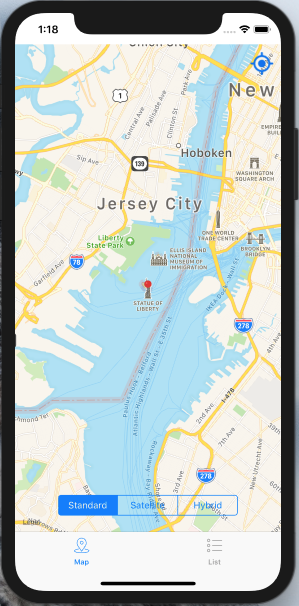
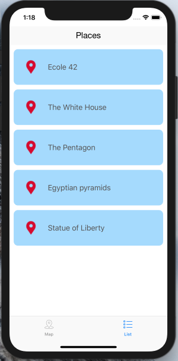

# Kanto

Geolocation is an indispensable weapon of the good iOS developer kit, it is essential to know how to use it.

Apple makes available to you different frameworks like MapKit which allows you to use a very simple map or CoreLocation which allows you to manage the user’s location.

This application uses:

1) TabBarController : to organise your different views.
2) MKMapView : for the map.
3) CLLocationManager : to geolocate the user.
4) SegmentedControlBar : to change the style of the map.
5) MKAnnotationView : to customize the pop-up map.

# Screanshots

